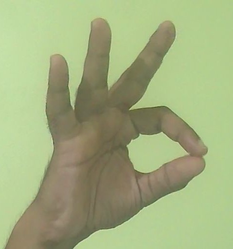
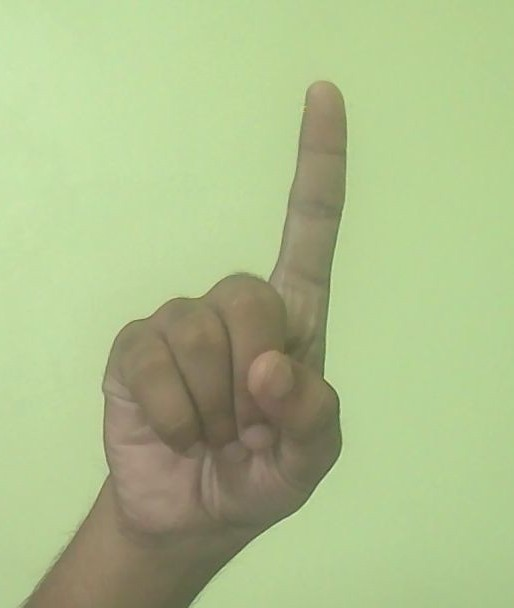

# AeroBoard alpha-v0.1
---
[DOWNLOAD NOW!](https://github.com/skzubairahmed/aeroboard/releases/tag/v0.1-alpha)

This is a opencv based air-whiteboard, you can draw anything using 3 main colours(RED, GREEN, BLUE), you can also clear the screen.

NOTE: I SUGGEST USING THE THE APPLICATION WHEN THE CAMERA IS FACING TOWARDS YOU, NOT AWAY FROM YOU! IF YOU DON'T WANT TO SHOW YOUR FACE THEN YOU MAY NOT KEEP IT IN THE FRAME, BUT FACING THE CAMERA TOWARDS YOU AND USING THE CORRECT FORM OF GESTURES WILL MAKE IT WORK VERY GOOD, PLEASE TELL ME IF THERE ARE ANY MORE PROBLEMS.

---

FEATURES:-
1. Finger tracking- The application can track all five fingers of any one hand at a time.

2. Gesture recognition - The application can predict what gesture you are using. For this version, I have added two main gestures(The PEN andn The POINTER), to use the PEN, you mest touch your index finger and thumb finger tips together, you will know that DRAW mode is turned on when the index finger and thumb finger tips glow with yello dots. To use the POINTER gesture, you must make a upward pointing gesture with you index finger.

3. Drawing - You can draw with the PEN geture, but remember that you must draw slowly(PS: THIS IS STILL THE alpha VERSION AND I'LL IMPROVE IT MORE.)

4. Changing colour - You can change color by clicking on any of the given colour options while using the POINTER gesture

5. Clearing - You can clear the screen by clicking on the Clear button using the POINTER gesture.

What I used for doing what?

1. Tracking:
    
    This mainly used opencv and mediapipe(through cvzone) to track the fingertip positions
2. Filters:

    I used simple 2D Kalman filters to remove the micro jitters in the fingertip positions which occurs when fingers are moved, i made the data more precise so the strokes become smoother and less jagged.
3. Gestures:

    I used some of my own code to determine the gesture which the user was showing, I have mainly integrated two gestures now(PEN and POINTER)

4. Logger:

    I have made my own logger class to log sany errors in a logfile.

5. AirButtons:

    I have made some of my own code for the AirButtons used to change the pen color and to clear the screen.

Correct gesture for PEN:- 

Correct gesture for POINTER:-

PS: I ADVICE YOU TO USE THE EXACT CORRECT GESTURES TO MAKE THE STROKES SMOOTHLY.
---

That pretty much sums it all up.

The application is only available for windows(.exe)*
---

[DOWNLOAD NOW!](https://github.com/skzubairahmed/aeroboard/releases/tag/v0.1-alpha)

Thank you :)

